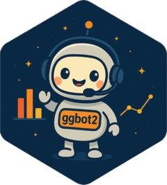

# ggbot2 

<!-- badges: start -->

[](https://lifecycle.r-lib.org/articles/stages.html#experimental)

<!-- badges: end -->

ggbot2 is a voice assistant for ggplot2. It helps you create and customize ggplot2 visualizations using voice commands.

## Prerequisites

In order to use ggbot, you will need an OpenAI API key. You can obtain one from the [OpenAI dashboard](https://platform.openai.com/api-keys). You'll also need to put at least a few dollars on your account to use the API.

Once you have an API key, you will need to set it as an environment variable named `OPENAI_API_KEY`. You can do this by adding the following line to an `.Renviron` file in your project directory:

```
OPENAI_API_KEY=your_api_key_here
```

Then restart your R session.

## Installation

```r
pak::pak("tidyverse/ggbot2")
```

## Usage

To launch ggbot, simply call the `ggbot()` function, passing in the name of a data frame variable:

```r
ggbot2::ggbot(mtcars)
```

## Act natural

There's no need to speak clearly, slowly, or formally to ggbot. Try speaking like you would to a person sitting across from you.

You don't ever have to wait for ggbot to finish talking; you can just start speaking and ggbot will quickly notice you are interrupting.

You don't have to be precise with your commands to ggbot. For example, give it a general sense of what you're trying to convey with your visualization. Or tell it what you don't like about the current version.

## Suggested prompts

Here are the kinds of things you can say to databot:

- "Create a scatter plot of mpg vs weight"
- "Color by cylinder"
- "Make the points blue and larger"
- "Add a title to the plot"
- "There are too many x-axis labels"
- "Add an annotation that calls out the year 2020"
- "Make the plot look less busy"
- "Let's go back to the last version"
